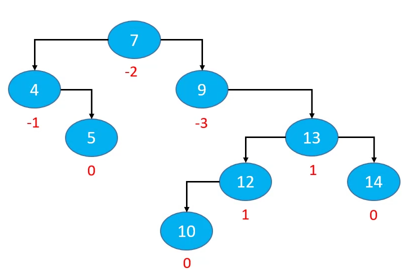
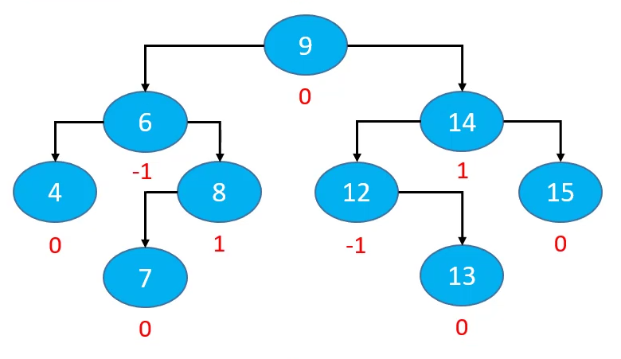
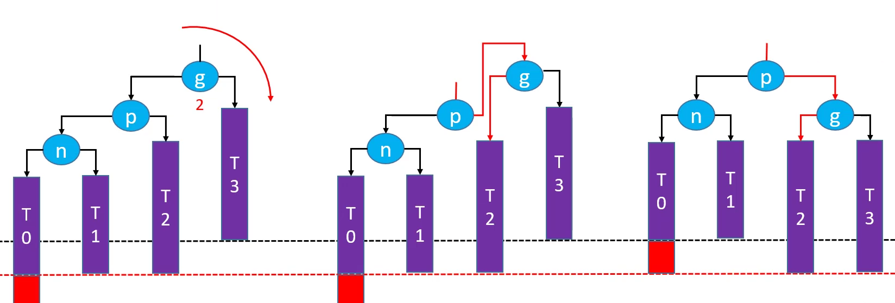
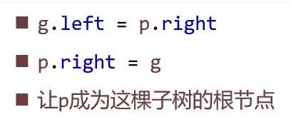
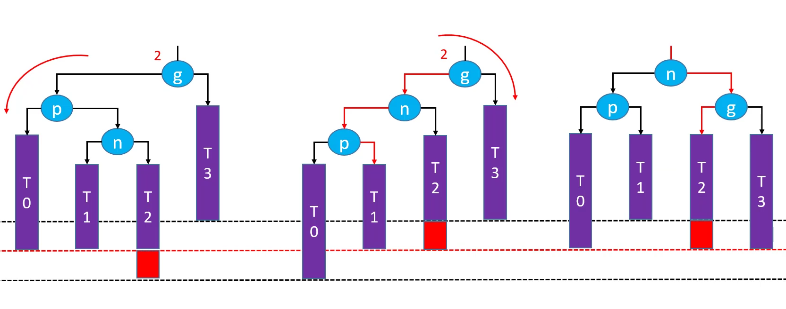

## 平衡因子

> 某节点的左右子树高度差

## 平衡二叉树

* 每个节点的平衡因子只可能是1、0、-1（绝对值小于等于1，如果超过1则称为失衡）
* 每个节点的左右子树高度差不超过1
* 搜索、添加、删除的时间复杂度都是O(logn)

## 旋转

> 旋转之后仍然是一颗二叉搜索树

LL 右旋转（单旋转） RR 左旋转（单旋转）

LR -> RR LL（先左旋转再右旋转） RL -> LL RR（先右旋转再左旋转）

以LR为例：先看P节点，其实是RR，对P进行左旋转，然后g就变成了RR，此时再对g进行右旋转

前驱结点 后继节点