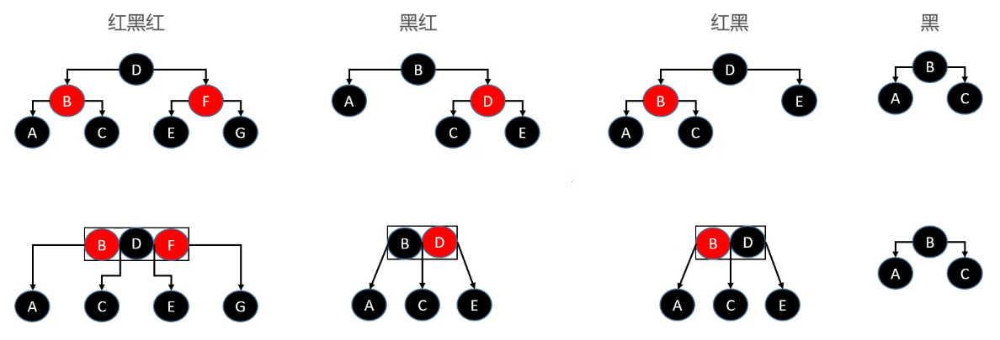

## 平衡因子

> 某节点的左右子树高度差

## 平衡二叉树

* 每个节点的平衡因子只可能是1、0、-1（绝对值小于等于1，如果超过1则称为失衡）
* 每个节点的左右子树高度差不超过1
* 搜索、添加、删除的时间复杂度都是O(logn)

## 旋转

> 旋转之后仍然是一颗二叉搜索树

LL 右旋转（单旋转） RR 左旋转（单旋转）

LR -> RR LL（先左旋转再右旋转） RL -> LL RR（先右旋转再左旋转）

以LR为例：先看P节点，其实是RR，对P进行左旋转，然后g就变成了RR，此时再对g进行右旋转

前驱结点 后继节点

## B树

m阶B树的性质

假设一个节点存储的元素个数为x

根节点元素个数：1 <= x <= m-1

非根节点：┌ m/2 ┐ − 1 ≤ x ≤ m − 1

如果有子节点，子节点个数 y = x + 1

根节点：2 ≤ y ≤ m

非根节点：┌ m/2 ┐ ≤ y ≤ m 向上取整

➢ 比如 m = 3，2 ≤ y ≤ 3，因此可以称为（2, 3）树、2-3树 ➢ 比如 m = 4，2 ≤ y ≤ 4，因此可以称为（2, 4）树、2-3-4树 ➢ 比如 m = 5，3 ≤ y ≤ 5，因此可以称为（3, 5）树 ➢
比如 m = 6，3 ≤ y ≤ 6，因此可以称为（3, 6）树 ➢ 比如 m = 7，4 ≤ y ≤ 7，因此可以称为（4, 7）树

数据库中一般用200-300阶B树

B树新添加元素必然是添加到叶子结点

◼ B树 和 二叉搜索树，在逻辑上是等价的 ◼ 多代节点合并，可以获得一个超级节点 2代合并的超级节点，最多拥有 4 个子节点（至少是 4阶B树） 3代合并的超级节点，最多拥有 8 个子节点（至少是 8阶B树）
n代合并的超级节点，最多拥有 2n个子节点（ 至少是 2n阶B树） ◼ m阶B树，最多需要 log2m 代合并

上溢

四阶B树，最大元素个数为3

解决方案

下溢

下溢到根节点就是，所有节点组合为一个新的根节点 - 变矮

## 红黑树

红黑树的性质

红黑树不需要维护平衡因子，只要保证添加删除的时候保证这五条性质，就能保证是红黑树

红黑树和4阶B树的等价变换（红色节点上移）

添加的四大情况

优先添加红色节点，除了性质4都能满足

总共有12种情况

向黑色节点下添加子节点，也能满足性质4，不须做其他处理，有四种

其他情况，基本是 染色 + 旋转

双红 LL RR

LR RL

上溢 LL RR LR RL

