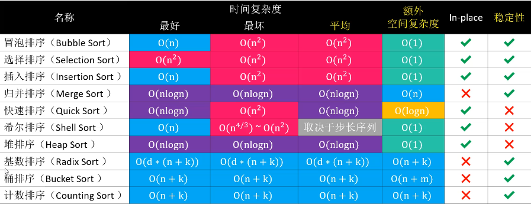
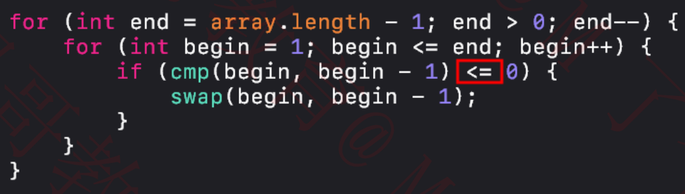

10大排序算法总结

* 以上表格是基于数组进行排序的一般性结论
* 冒泡、选择、插入、归并、快速、希尔、堆排序，属于比较排序（Comparison Sorting）

排序算法的稳定性(Stability)

* 如果相等的2个元素，在排序前后的相对位置保持不变，那么这是稳定的排序算法
    * 排序前：5, 1, 3𝑎, 4, 7, 3𝑏
    * 稳定的排序： 1, 3𝑎, 3𝑏, 4, 5, 7
    * 不稳定的排序：1, 3𝑏, 3𝑎, 4, 5, 7
    * 对自定义对象进行排序时，稳定性会影响最终的排序效果

原地算法（In-place Algorithm）

* 不依赖额外的资源或者依赖少数的额外资源，仅依靠输出来覆盖输入
* 空间复杂度为 𝑂(1) 的都可以认为是原地算法
* 非原地算法，称为 Not-in-place 或者 Out-of-place

> 升序为例子

## 冒泡排序

### 实现原理

1. 从头开始比较每一对相邻元素，如果第1个比第2个大，就交换它们的位置
    1. 执行完一轮后，最末尾那个元素就是最大的元素
2. 忽略 1. 中曾经找到的最大元素，重复执行步骤 1.，直到全部元素有序
3. 优化，考虑数组有序情况，比如给出的默认数组为有序，或者经过某次排序之后数组已经变为全部有序状态

* 冒泡排序属于稳定的排序算法
    * 稍有不慎，稳定的排序算法也能被写成不稳定的排序算法，比如下面的冒泡排序代码是不稳定的
      
* 冒泡排序属于 In-place

### 复杂度

#### 时间复杂度

* 最坏、平均情况O(n²)
* 最好情况O(n)

#### 空间复杂度

O(1)

## 参考资料

https://visualgo.net/zh/sorting